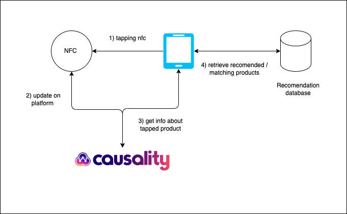

# NFC Based Product recomendation

## Introduction 

NFC (Near Field Communication)-based product recommendation is an innovative approach that leverages the proximity of NFC-enabled devices to provide personalized shopping experiences. By integrating NFC technology into products, retailers can offer customers tailored recommendations based on their preferences and previous interactions. When a customer taps their NFC-enabled smartphone or device on a product, it triggers an instant connection with the store's system, which can then suggest related items or promotions. This method enhances customer engagement by providing real-time, relevant suggestions, making shopping more intuitive and personalized. NFC-based product recommendations can be used in various environments such as retail stores, exhibitions, or even museums, creating an interactive and seamless experience for consumers.

## Tech Stack
- Python -> Flask
- Causality Platform for NFC integraton ->  https://causality.xyz

## System Design 

